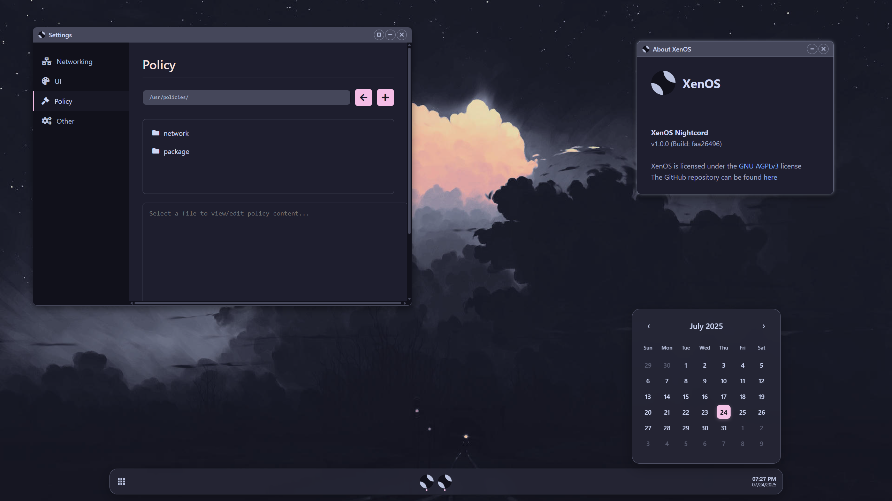
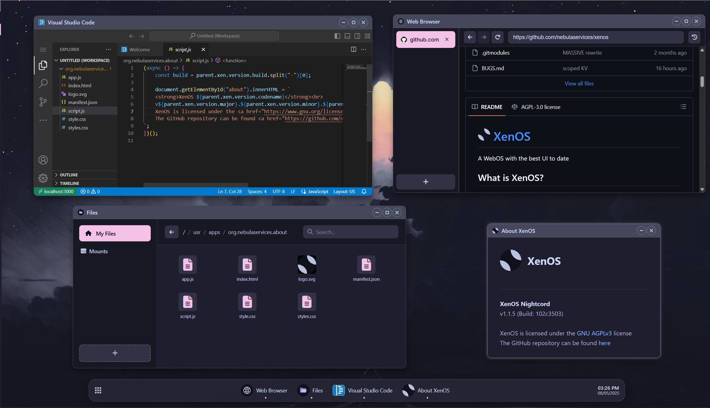

<h1>
  
  <strong><a href="https://xen-os.dev">XenOS</a></strong>
</h1>
A WebOS with the best UI to date

## What is XenOS?
XenOS is a highly customizable "WebOS" with **a ton** of features and a sleek UI. You can view a live demo at: https://xen-os.dev/

 |  |
| --- | --- |

## Developing XenOS
### Dependencies
- NodeJS
- NPM (PNPM is **strongly** recommended)
- Git
- `uuidgen`

Currently XenOS supports building on Windows, but we cannot promise compatibility forever. We recommended using WSL
### Instructions
First, clone the repo
```sh
$ git clone https://github.com/nebulaservices/xenos.git --recursive
$ cd xenos
```
Install dependencies
```sh
pnpm i # Or npm i
```
To start the dev server
```sh
# If you are on Linux, MacOS, or some other UNIX-like OS:
pnpm dev # or npm run build

# If you are on Windows, or are just a weirdo who enjoys Powershell
pnpm dev:windows # or npm run build:windows
```
To build
```sh
# Same spiel as above
pnpm build
pnpm build:windows
```
To serve the build
```sh
pnpm start # or npm start
```

## Documentation
Documentation about XenOS can be found [here!](https://github.com/NebulaServices/XenOS/tree/main/docs)

## Whats Left?
You can view the projects TODO [here](https://github.com/NebulaServices/XenOS/blob/main/TODO.md)

## I Found a Bug!!!!
Cool! You can submit things like bug reports in our [Discord Server](https://discord.gg/unblocker), but please check if the bug has already been reported. You can check in the Discord or [here](./BUGS.md)

## Changelog
The changelog can be found [here](./CHANGELOG.md)

## Contributors
- [Scaratek](https://github.com/scaratech) - Lead developer
- [Madjik](https://github.com/madjikdotpng) - Various UI tweaks and logo designer

## Credit
- The default wallpaper used: https://userstyles.org/styles/277430/font-change
- The color scheme used: https://catppuccin.com/palette/ (mocha)
- Major inspiration: [AnuraOS](https://anura.pro)

## Dependencies used
- [Workbox](https://developer.chrome.com/docs/workbox)
- [Bare-Mux](https://github.com/mercuryworkshop/bare-mux)
- [Ultraviolet](https://github.com/titaniumnetwork-dev/ultraviolet)
- [Comlink](https://github.com/GoogleChromeLabs/comlink)
- [JSZip](https://stuk.github.io/jszip/)
- [libcurl.js](https://github.com/ading2210/libcurl.js)
- [wisp-client-js](github.com/mercuryworkshop/wisp-client-js)
  
There are more dependencies used that are not listed here, for a full list, check the [package.json](https://github.com/NebulaServices/XenOS/blob/main/package.json)

## What Framework Do You Use?!?
None! Just TypeScript and CSS :)

## Source Code License
XenOS is licensed under the [AGPLv3 License](https://www.gnu.org/licenses/agpl-3.0.en.html)
